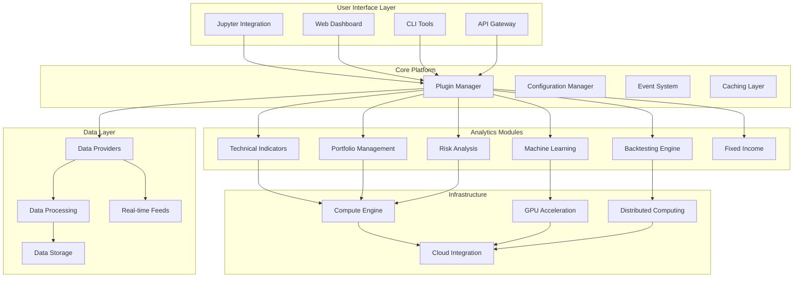

# Design Document

## Overview

The Ultimate Quantitative Development Platform will transform MeridianAlgo into a comprehensive, high-performance ecosystem that integrates the best features from leading quantitative finance libraries while maintaining superior usability and extensibility. The platform will be built on a modular, plugin-based architecture that supports everything from basic technical analysis to institutional-grade portfolio management and machine learning-driven trading strategies.

## Architecture

### Core Architecture Principles

1. **Modular Design**: Each major functionality area (data, indicators, portfolio, backtesting, ML) will be implemented as independent modules with well-defined interfaces
2. **Performance-First**: Critical paths will use Numba JIT compilation, vectorized operations, and GPU acceleration where applicable
3. **Extensibility**: Plugin architecture allows third-party extensions and custom implementations
4. **Scalability**: Distributed computing support for large-scale operations
5. **Compatibility**: Seamless integration with existing Python data science ecosystem

### High-Level System Architecture



## Components and Interfaces

### 1. Data Infrastructure (`meridianalgo.data`)

#### DataProvider Interface
```python
class DataProvider(ABC):
    @abstractmethod
    def get_historical_data(self, symbols: List[str], start: datetime, end: datetime) -> pd.DataFrame
    
    @abstractmethod
    def get_real_time_data(self, symbols: List[str]) -> pd.DataFrame
    
    @abstractmethod
    def get_fundamental_data(self, symbols: List[str]) -> pd.DataFrame
```

#### Supported Data Sources
- **Market Data**: Yahoo Finance, Alpha Vantage, Quandl, IEX Cloud, Polygon, FRED
- **Alternative Data**: News sentiment (NewsAPI, Bloomberg), Social media (Twitter, Reddit)
- **Economic Data**: FRED, World Bank, IMF
- **Crypto Data**: CoinGecko, Binance, Coinbase Pro

#### Data Processing Pipeline
```python
class DataPipeline:
    def __init__(self):
        self.processors = [
            DataValidator(),
            OutlierDetector(),
            MissingDataHandler(),
            DataNormalizer()
        ]
    
    def process(self, data: pd.DataFrame) -> pd.DataFrame:
        for processor in self.processors:
            data = processor.transform(data)
        return data
```

### 2. Technical Analysis Engine (`meridianalgo.indicators`)

#### Indicator Framework
```python
class BaseIndicator(ABC):
    def __init__(self, **params):
        self.params = params
        self._compiled_func = None
    
    @abstractmethod
    def calculate(self, data: pd.DataFrame) -> Union[pd.Series, pd.DataFrame]
    
    def _compile(self):
        """JIT compile the calculation function for performance"""
        if self._compiled_func is None:
            self._compiled_func = numba.jit(self._raw_calculate, nopython=True)
```

#### Indicator Categories
1. **Momentum Indicators** (30+): RSI, Stochastic, Williams %R, ROC, MFI, etc.
2. **Trend Indicators** (25+): Moving Averages, MACD, ADX, Aroon, Parabolic SAR, etc.
3. **Volatility Indicators** (15+): Bollinger Bands, ATR, Keltner Channels, etc.
4. **Volume Indicators** (20+): OBV, Accumulation/Distribution, Chaikin Oscillator, etc.
5. **Pattern Recognition** (50+): Candlestick patterns, Chart patterns
6. **Custom Indicators**: Framework for user-defined indicators

### 3. Portfolio Management System (`meridianalgo.portfolio`)

#### Portfolio Optimizer Architecture
```python
class PortfolioOptimizer:
    def __init__(self, method: str = 'mean_variance'):
        self.method = method
        self.optimizers = {
            'mean_variance': MeanVarianceOptimizer(),
            'black_litterman': BlackLittermanOptimizer(),
            'risk_parity': RiskParityOptimizer(),
            'hierarchical_risk_parity': HRPOptimizer(),
            'factor_model': FactorModelOptimizer()
        }
    
    def optimize(self, returns: pd.DataFrame, **kwargs) -> Dict[str, float]:
        return self.optimizers[self.method].optimize(returns, **kwargs)
```

#### Risk Management Components
- **VaR Models**: Historical, Parametric, Monte Carlo, Filtered Historical Simulation
- **Stress Testing**: Historical scenarios, Monte Carlo simulation, Custom stress tests
- **Risk Metrics**: Maximum Drawdown, Tail Risk, Correlation analysis
- **Attribution Analysis**: Factor-based performance attribution

### 4. Backtesting Engine (`meridianalgo.backtesting`)

#### Event-Driven Architecture
```python
class BacktestEngine:
    def __init__(self):
        self.event_queue = Queue()
        self.data_handler = None
        self.strategy = None
        self.portfolio = None
        self.execution_handler = None
    
    def run_backtest(self):
        while True:
            if not self.event_queue.empty():
                event = self.event_queue.get()
                self._handle_event(event)
            else:
                break
```

#### Market Simulation Features
- **Realistic Market Conditions**: Slippage models, Transaction costs, Market impact
- **Order Management**: All order types (Market, Limit, Stop, Bracket, OCO)
- **Data Handling**: Tick, minute, daily data with proper timestamp alignment
- **Performance Analytics**: Comprehensive metrics and risk analysis

### 5. Machine Learning Framework (`meridianalgo.ml`)

#### ML Pipeline Architecture
```python
class MLPipeline:
    def __init__(self):
        self.feature_engineer = FinancialFeatureEngineer()
        self.model_selector = ModelSelector()
        self.validator = FinancialCrossValidator()
        self.deployer = ModelDeployer()
    
    def build_model(self, data: pd.DataFrame, target: str) -> MLModel:
        features = self.feature_engineer.transform(data)
        model = self.model_selector.select_best_model(features, target)
        validated_model = self.validator.validate(model, features, target)
        return self.deployer.deploy(validated_model)
```

#### Supported Models
- **Deep Learning**: LSTM, GRU, Transformer, CNN for time series
- **Traditional ML**: Random Forest, XGBoost, SVM with financial adaptations
- **Reinforcement Learning**: DQN, PPO, A3C for trading strategies
- **Generative Models**: GANs for synthetic data generation

### 6. Fixed Income and Derivatives (`meridianalgo.fixed_income`)

#### Bond Pricing Engine
```python
class BondPricer:
    def __init__(self, yield_curve: YieldCurve):
        self.yield_curve = yield_curve
    
    def price_bond(self, bond: Bond) -> float:
        return sum(cf / (1 + self.yield_curve.get_rate(t))**t 
                  for cf, t in bond.cash_flows())
```

#### Options Pricing Models
- **Black-Scholes**: European options with Greeks calculation
- **Binomial/Trinomial**: American options and exotic payoffs
- **Monte Carlo**: Path-dependent options and complex payoffs
- **Finite Difference**: PDE-based pricing for complex instruments

## Data Models

### Core Data Structures

#### Market Data Model
```python
@dataclass
class MarketData:
    symbol: str
    timestamp: datetime
    open: float
    high: float
    low: float
    close: float
    volume: int
    adjusted_close: Optional[float] = None
    
    def to_ohlcv(self) -> Tuple[float, float, float, float, int]:
        return (self.open, self.high, self.low, self.close, self.volume)
```

#### Portfolio Model
```python
@dataclass
class Portfolio:
    positions: Dict[str, Position]
    cash: float
    timestamp: datetime
    
    def total_value(self, prices: Dict[str, float]) -> float:
        return self.cash + sum(pos.quantity * prices.get(pos.symbol, 0) 
                              for pos in self.positions.values())
```

#### Strategy Model
```python
class Strategy(ABC):
    @abstractmethod
    def generate_signals(self, data: pd.DataFrame) -> pd.DataFrame:
        pass
    
    @abstractmethod
    def calculate_position_sizes(self, signals: pd.DataFrame, 
                               portfolio: Portfolio) -> Dict[str, float]:
        pass
```

### Database Schema

#### Time Series Data Storage
- **Primary Storage**: Parquet files with partitioning by date and symbol
- **Fast Access**: Redis for real-time data and frequently accessed historical data
- **Metadata**: PostgreSQL for instrument metadata, corporate actions, etc.

## Error Handling

### Exception Hierarchy
```python
class MeridianAlgoException(Exception):
    """Base exception for all MeridianAlgo errors"""
    pass

class DataError(MeridianAlgoException):
    """Data-related errors (missing data, invalid format, etc.)"""
    pass

class CalculationError(MeridianAlgoException):
    """Calculation and numerical errors"""
    pass

class BacktestError(MeridianAlgoException):
    """Backtesting-related errors"""
    pass
```

### Error Recovery Strategies
1. **Data Errors**: Automatic fallback to alternative data sources
2. **Calculation Errors**: Graceful degradation with warning messages
3. **Network Errors**: Retry logic with exponential backoff
4. **Memory Errors**: Automatic chunking for large datasets

## Testing Strategy

### Testing Framework Architecture
```python
class FinancialTestCase(unittest.TestCase):
    def setUp(self):
        self.test_data = self.load_test_data()
        self.benchmark_results = self.load_benchmarks()
    
    def assert_financial_accuracy(self, result, expected, tolerance=1e-6):
        """Custom assertion for financial calculations"""
        pass
```

### Test Categories

#### 1. Unit Tests
- **Indicator Tests**: Verify calculations against known benchmarks (TA-Lib, Bloomberg)
- **Portfolio Tests**: Test optimization algorithms against academic papers
- **ML Tests**: Validate feature engineering and model performance

#### 2. Integration Tests
- **Data Pipeline Tests**: End-to-end data flow validation
- **Backtesting Tests**: Strategy performance against historical benchmarks
- **API Tests**: External data provider integration

#### 3. Performance Tests
- **Benchmark Tests**: Performance comparison with existing libraries
- **Scalability Tests**: Large dataset processing capabilities
- **Memory Tests**: Memory usage optimization validation

#### 4. Financial Validation Tests
- **Accuracy Tests**: Results validation against Bloomberg, Reuters
- **Regulatory Tests**: Compliance with financial regulations
- **Risk Model Tests**: Risk metric validation against industry standards

### Continuous Integration Pipeline
1. **Code Quality**: Black formatting, flake8 linting, mypy type checking
2. **Unit Tests**: Comprehensive test suite with >95% coverage
3. **Performance Benchmarks**: Automated performance regression testing
4. **Documentation**: Automatic API documentation generation
5. **Security Scanning**: Dependency vulnerability scanning

## Performance Optimization

### Computational Optimizations
1. **Numba JIT**: Critical calculation paths compiled to machine code
2. **Vectorization**: NumPy/Pandas vectorized operations throughout
3. **GPU Acceleration**: CuPy integration for large-scale computations
4. **Parallel Processing**: Joblib/Dask for embarrassingly parallel tasks

### Memory Management
1. **Lazy Loading**: Data loaded on-demand to minimize memory usage
2. **Chunking**: Large datasets processed in chunks
3. **Caching**: Intelligent caching of frequently accessed data
4. **Memory Mapping**: Large files accessed via memory mapping

### Distributed Computing
1. **Dask Integration**: Distributed DataFrames for large datasets
2. **Ray Support**: Distributed machine learning and backtesting
3. **Cloud Deployment**: AWS/GCP/Azure integration for scalability
4. **Container Support**: Docker containers for consistent deployment

## Security Considerations

### Data Security
1. **API Key Management**: Secure storage and rotation of API keys
2. **Data Encryption**: Encryption at rest and in transit
3. **Access Control**: Role-based access to sensitive data
4. **Audit Logging**: Comprehensive logging of data access

### Code Security
1. **Dependency Scanning**: Regular vulnerability scanning
2. **Input Validation**: Strict validation of all user inputs
3. **Sandboxing**: Isolated execution of user-defined strategies
4. **Code Review**: Mandatory security review for all changes